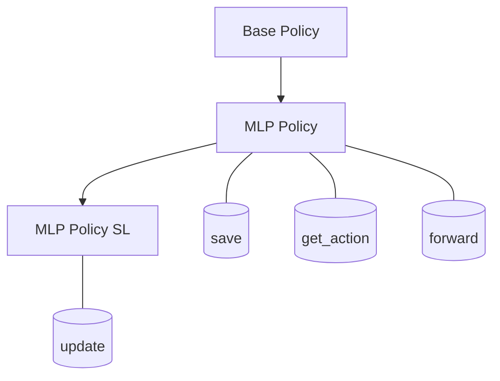
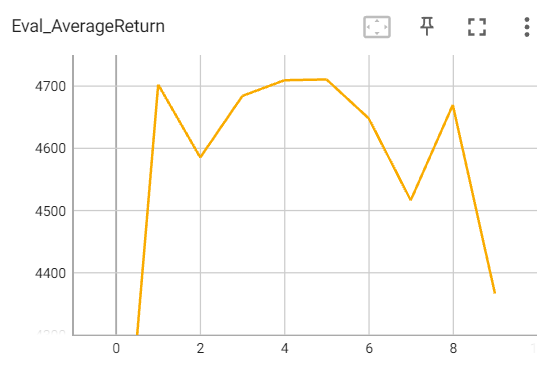

# Assignment 1: Imitation Learning

## Q 1.1

### 环境搭建(To be updated)

首先是需要对环境进行安装, 此处可以参考[installation.md](installation.md), 但是需要注意的是需要安装python3.7的环境`conda create -n cs285 python=3.7`(参考[这篇文章所述的内容](https://gitee.com/kin_zhang/drl-hwprogramm/blob/solution/hw1/solution.md)). 对于windows下mujoco-py与mujoco的安装可以参考[这篇文章](https://zhuanlan.zhihu.com/p/383655571).

hw1中代码的最终运行仍然使用ipynb, 主要删除了原来代码中的Colab的设置函数.

ps: 这个作业真的用windows太多坑了, 查都查不到的那种... 所以之后准备换到Linux上去了, 实在不想使用Colab

### 文件内容Complete

文件阅读顺序:

```
• scripts/run hw1.py
• infrastructure/rl_trainer.py
• agents/bc_agent.py (another read-only file)
• policies/MLP policy.py
• infrastructure/replay_buffer.py
• infrastructure/utils.py
• infrastructure/pytorch_utils.py
```

#### run_hw.py

这部分文件主要定义了一个`BC_Trainer`类与`main`函数, 通过这两个部分的内容, main函数主要有一个argparse的用法, 此处参考对应的文档就可以理解了. `BC_Trainer`中有BC_Agent和RL_trainer类, 通过原理我们可以知道在训练的循环过程中我们能够更好地完善整个代码. 所以下一个部分我们直接跳到主干部分代码(位于`RL_trainer`中).

#### 主干部分代码

主干部分代码就是`run_training_loop`部分的代码, 该部分代码可以更好地帮助我们理解`hw1`的作业内容, 该部分对标有`TODO`部分的代码进行粗略的解读, 更加详细的介绍会在之后各部分的问题中进行解读. 根据代码我们可以将这部分的代码分为几个部分:
    1. 采样(collect the training trajectories)
    2. 是否do_dagger(relabel the collected obs with actions from a provided expert policy?)
    3. 将paths加入到agent中(在BC_Agent中发现 Replay buffer也在其中)
    4. 训练agent

ps: 在ipynb中对一些参数有过介绍

```python
    def run_training_loop(self, n_iter, collect_policy, eval_policy,
                        initial_expertdata=None, relabel_with_expert=False,
                        start_relabel_with_expert=1, expert_policy=None):
        """
        :param n_iter:  number of (dagger) iterations
        :param collect_policy:
        :param eval_policy:
        :param initial_expertdata:
        :param relabel_with_expert:  whether to perform dagger
        :param start_relabel_with_expert: iteration at which to start relabel with expert
        :param expert_policy:
        """

        # init vars at beginning of training
        self.total_envsteps = 0
        self.start_time = time.time()

        for itr in range(n_iter):
            print("\n\n********** Iteration %i ************"%itr)

            # decide if videos should be rendered/logged at this iteration
            if itr % self.params['video_log_freq'] == 0 and self.params['video_log_freq'] != -1:
                self.log_video = True
            else:
                self.log_video = False

            # decide if metrics should be logged
            if itr % self.params['scalar_log_freq'] == 0:
                self.log_metrics = True
            else:
                self.log_metrics = False

            # collect trajectories, to be used for training
            training_returns = self.collect_training_trajectories(
                itr,
                initial_expertdata,
                collect_policy,
                self.params['batch_size']
            )  # HW1: implement this function below
            paths, envsteps_this_batch, train_video_paths = training_returns
            self.total_envsteps += envsteps_this_batch

            # relabel the collected obs with actions from a provided expert policy
            if relabel_with_expert and itr>=start_relabel_with_expert:
                paths = self.do_relabel_with_expert(expert_policy, paths)  # HW1: implement this function below

            # add collected data to replay buffer
            self.agent.add_to_replay_buffer(paths)

            # train agent (using sampled data from replay buffer)
            training_logs = self.train_agent()  # HW1: implement this function below

            # log/save
            if self.log_video or self.log_metrics:

                # perform logging
                print('\nBeginning logging procedure...')
                self.perform_logging(
                    itr, paths, eval_policy, train_video_paths, training_logs)

                if self.params['save_params']:
                    print('\nSaving agent params')
                    self.agent.save('{}/policy_itr_{}.pt'.format(self.params['logdir'], itr))
```

#### collect_training_trajectories

该部分的代码主要是收集训练的轨迹, 除了要完成该函数本身的内容外, 还涉及到了utils中的内容.

首先根据提示, 我们需要传入和返回的参数长这样, batch size实际代表了[observation, action]这个的二元组的数量是多少(实际也就是我们在做深度神经网络的训练时候每一个step的batch size的大小), 如下所示:

```python
def collect_training_trajectories(
            self,
            itr,
            load_initial_expertdata,
            collect_policy,
            batch_size,
    ):
        """
        :param itr:
        :param load_initial_expertdata:  path to expert data pkl file
        :param collect_policy:  the current policy using which we collect data
        :param batch_size:  the number of transitions we collect
        :return:
            paths: a list trajectories
            envsteps_this_batch: the sum over the numbers of environment steps in paths
            train_video_paths: paths which also contain videos for visualization purposes
        """
```

第一个需要我们填充的内容就是此处了, 根据提示, 我们可以很快填完下面步骤的内容:

```python
        # TODO decide whether to load training data or use the current policy to collect more data
        # HINT: depending on if it's the first iteration or not, decide whether to either
                # (1) load the data. In this case you can directly return as follows
                # ``` return loaded_paths, 0, None ```
        if itr == 0:
            with open(load_initial_expertdata, 'rb') as f:
                loaded_paths = pickle.loads(f.read())
            return loaded_paths, 0, None
```

其次是`sample_trajectories`与`sample_trajectory`函数, 其主要的填写逻辑也比较简单, `sample_trajectories`会在Q1.2中提到. 而`sample_trajectory`函数, 主要是和`env`进行交互得到的, 其主要思路也非常清晰: 第一次进入的时候要从`env`中得到初始的`ob`, 然后在循环中不停的产生`ob`, 通过`policy`得到`ac`, 这样不停的收集收集, 直到每条trajectory到达最大长度或者是`done == 0`(这取决于env的设置, 在此处我们不需要管这里)

```python
        ###################   collect_training_trajectories函数的一部分 ##############################   
        # TODO collect `batch_size` samples to be used for training
        # HINT1: use sample_trajectories from utils
        # HINT2: you want each of these collected rollouts to be of length self.params['ep_len']
        print("\nCollecting data to be used for training...")
        paths, envsteps_this_batch = utils.sample_trajectories(self.env, collect_policy, batch_size, self.params['ep_len'])

        ###################   sample_trajectories from utils           ##############################
        def sample_trajectory(env, policy, max_path_length, render=False, render_mode=('rgb_array')):

            # initialize env for the beginning of a new rollout
            ob = env.reset() # HINT: should be the output of resetting the env

            # init vars
            obs, acs, rewards, next_obs, terminals, image_obs = [], [], [], [], [], []
            steps = 0
            while True:

                # render image of the simulated env
                if render:
                    if 'rgb_array' in render_mode:
                        if hasattr(env, 'sim'):
                            image_obs.append(env.sim.render(camera_name='track', height=500, width=500)[::-1])
                        else:
                            image_obs.append(env.render(mode=render_mode))
                    if 'human' in render_mode:
                        env.render(mode=render_mode)
                        time.sleep(env.model.opt.timestep)

                # use the most recent ob to decide what to do
                obs.append(ob)
                ac = policy.get_action(ob) # HINT: query the policy's get_action function
                ac = ac[0]
                acs.append(ac)

                # take that action and record results
                ob, rew, done, _ = env.step(ac)

                # record result of taking that action
                steps += 1
                next_obs.append(ob)
                rewards.append(rew)

                # TODO end the rollout if the rollout ended
                # HINT: rollout can end due to done, or due to max_path_length
                rollout_done = 1 if steps >= max_path_length else done # HINT: this is either 0 or 1
                terminals.append(rollout_done)

                if rollout_done:
                    break

            return Path(obs, image_obs, acs, rewards, next_obs, terminals)        
        ###################   sample_trajectory from utils             ############################## 
        def sample_trajectories(env, policy, min_timesteps_per_batch, max_path_length, render=False, render_mode=('rgb_array')):
            """
                Collect rollouts until we have collected min_timesteps_per_batch steps.

                TODO implement this function
                Hint1: use sample_trajectory to get each path (i.e. rollout) that goes into paths
                Hint2: use get_pathlength to count the timesteps collected in each path
            """
            timesteps_this_batch = 0
            paths = []
            while timesteps_this_batch < min_timesteps_per_batch:
                path = sample_trajectory(env, policy, max_path_length, render)
                paths.append(path)
                timesteps_this_batch += get_pathlength(path)

            return paths, timesteps_this_batch
```

#### train the agent

在train部分, 我们首先是要回到`train_agent`函数这里来, 这里的agent其实很容易发现是`bc_agent`(可以通过`run_hw1.py`的`BC_trainer`类可以找到依据). 这个时候我们可以发现以下函数中其实还有一个step的参数, 也就是说我们是在每一个iteration中做一次完整的policy的训练, 中间还要进行sample, 符合我们那个Dagger所给出的流程, 根据其提示我们可以得到以下代码:

```python
    def train_agent(self):
        print('\nTraining agent using sampled data from replay buffer...')
        all_logs = []
        for train_step in range(self.params['num_agent_train_steps_per_iter']):

            # TODO sample some data from the data buffer
            # HINT1: use the agent's sample function
            # HINT2: how much data = self.params['train_batch_size']
            ob_batch, ac_batch, re_batch, next_ob_batch, terminal_batch = self.agent.sample(self.params['train_batch_size'])

            # TODO use the sampled data to train an agent
            # HINT: use the agent's train function
            # HINT: keep the agent's training log for debugging
            train_log = self.agent.train(ob_batch, ac_batch, re_batch, next_ob_batch, terminal_batch)
            all_logs.append(train_log)
        return all_logs
```

`sample`(在`replay_buffer`部分的进行填充), sample batch size大小的数据出来, 按照sample_index进行索引.

```python
    def sample_random_data(self, batch_size):
        assert (
                self.obs.shape[0]
                == self.acs.shape[0]
                == self.rews.shape[0]
                == self.next_obs.shape[0]
                == self.terminals.shape[0]
        )

        ## TODO return batch_size number of random entries from each of the 5 component arrays above
        ## HINT 1: use np.random.permutation to sample random indices
        ## HINT 2: return corresponding data points from each array (i.e., not different indices from each array)
        ## HINT 3: look at the sample_recent_data function below

        sample_index = np.random.permutation(self.obs.shape[0])[-batch_size:]
        return (
            self.obs[sample_index],
            self.acs[sample_index],
            self.rews[sample_index],
            self.next_obs[sample_index],
            self.terminals[sample_index],
        )
```

这部分内容和深度学习的部分非常相似, 在了解Stanford的cs231n课程后, 这部分的内容填充就会比较简单. 个人认为这部分内容很值得学习的地方在于类的继承(Base Policy类给出backbone而不给出任何实现, MLP policy给出一些基本的实现, SL中再给出update的实现), 同时, 增加了`pytorch_utils.py`给出一些和torch相关的操作, 分工非常明确, 而且区分了`get_action`与`forward`函数的区别, 如下图所示, 可以看到整个类的结构(这个mermaid虽然不够标准但是还是比较清晰的...).



最后就是填充以下内容了, 就不详细叙述了, 所有的内容都可以做一次torch的官方demo解决. 重点是要读一下MLP_Policy文档

```python
class MLPPolicy(BasePolicy, nn.Module, metaclass=abc.ABCMeta):

    def __init__(self,
                 ac_dim,
                 ob_dim,
                 n_layers,
                 size,
                 discrete=False,
                 learning_rate=1e-4,
                 training=True,
                 nn_baseline=False,
                 **kwargs
                 ):
        super().__init__(**kwargs)

        # init vars
        self.ac_dim = ac_dim
        self.ob_dim = ob_dim
        self.n_layers = n_layers
        self.discrete = discrete
        self.size = size
        self.learning_rate = learning_rate
        self.training = training
        self.nn_baseline = nn_baseline

        if self.discrete:
            self.logits_na = ptu.build_mlp(
                input_size=self.ob_dim,
                output_size=self.ac_dim,
                n_layers=self.n_layers,
                size=self.size,
            )
            self.logits_na.to(ptu.device)
            self.mean_net = None
            self.logstd = None
            self.optimizer = optim.Adam(self.logits_na.parameters(),
                                        self.learning_rate)
        else:
            self.logits_na = None
            self.mean_net = ptu.build_mlp(
                input_size=self.ob_dim,
                output_size=self.ac_dim,
                n_layers=self.n_layers, size=self.size,
            )
            self.mean_net.to(ptu.device)
            self.logstd = nn.Parameter(
                torch.zeros(self.ac_dim, dtype=torch.float32, device=ptu.device)
            )
            self.logstd.to(ptu.device)
            self.optimizer = optim.Adam(
                itertools.chain([self.logstd], self.mean_net.parameters()),
                self.learning_rate
            )

    ##################################

    def save(self, filepath):
        torch.save(self.state_dict(), filepath)

    ##################################

    def get_action(self, obs: np.ndarray) -> np.ndarray:
        if len(obs.shape) > 1:
            observation = obs
        else:
            observation = obs[None]
            
        # TODO return the action that the policy prescribes
        return ptu.to_numpy(self.forward(ptu.from_numpy(observation)))

    # update/train this policy
    def update(self, observations, actions, **kwargs):
        raise NotImplementedError

    # This function defines the forward pass of the network.
    # You can return anything you want, but you should be able to differentiate
    # through it. For example, you can return a torch.FloatTensor. You can also
    # return more flexible objects, such as a
    # `torch.distributions.Distribution` object. It's up to you!
    def forward(self, observation: torch.FloatTensor) -> Any:
        if self.discrete:
            return self.logits_na(observation)
        else:
            return self.mean_net(observation)

#####################################################
#####################################################

class MLPPolicySL(MLPPolicy):
    def __init__(self, ac_dim, ob_dim, n_layers, size, **kwargs):
        super().__init__(ac_dim, ob_dim, n_layers, size, **kwargs)
        self.loss = nn.MSELoss()

    def update(
            self, observations, actions,
            adv_n=None, acs_labels_na=None, qvals=None
    ):
        # TODO: update the policy and return the loss
        
        self.optimizer.zero_grad() # zeroes the gradient buffers of all parameters

        loss = self.loss(
            self.forward(ptu.from_numpy(observations)), ptu.from_numpy(actions)
        )
        loss.backward()
        self.optimizer.step()

        return {
            # You can add extra logging information here, but keep this line
            'Training Loss': ptu.to_numpy(loss),
        }
```

还有就是build_mlp函数, 在`pytorch_utils`里面, 同样也是可以跟着官方文档走一个demo就可以了解用法了:

```python
def build_mlp(
        input_size: int,
        output_size: int,
        n_layers: int,
        size: int,
        activation: Activation = 'tanh',
        output_activation: Activation = 'identity',
) -> nn.Module:
    """
        Builds a feedforward neural network

        arguments:
            n_layers: number of hidden layers
            size: dimension of each hidden layer
            activation: activation of each hidden layer

            input_size: size of the input layer
            output_size: size of the output layer
            output_activation: activation of the output layer

        returns:
            MLP (nn.Module)
    """
    if isinstance(activation, str):
        activation = _str_to_activation[activation]
    if isinstance(output_activation, str):
        output_activation = _str_to_activation[output_activation]

    # TODO: return a MLP. This should be an instance of nn.Module
    # Note: nn.Sequential is an instance of nn.Module.
    mlp_layers = list()
    # the dimension is the same for each hidden layer
    mlp_layers.append(nn.Linear(input_size, size))
    mlp_layers.append(activation)
    for i in range(n_layers-1):
        mlp_layers.append(
            nn.Linear(size, size)
        )

        mlp_layers.append(activation)

    mlp_layers.append(nn.Linear(size, output_size))
    mlp_layers.append(output_activation)

    return nn.Sequential(
        *mlp_layers
    )
```

## Q 1.2

根据Note中的提示, 通过文件查找的方式, 可以发现`eval_batch_size`与`ep_len`被作为两个参数传入`utils.sample_trajectories`函数中, 也就是`max_path_length`为参数`ep_len`(即sample的每条路的最大长度为这么多, 当然根据Sergey在课程中所提到的, 可能提前end), `min_timesteps_per_batch`为`eval_batch_size`(根据`while timesteps_this_batch < min_timesteps_per_batch:`可以知道所有的路的长度不能超过这么多). 也就是作业中提到的这句话: your eval batch size should be greater than ep len, such that you’re collecting multiple rollouts when evaluating the performance of your trained policy. For example, if ep len is 1000 and eval batch size is 5000, then you’ll be collecting approximately 5 trajectories (maybe more if any of them terminate early)

```python
    def perform_logging(self, itr, paths, eval_policy, train_video_paths, training_logs):

        # collect eval trajectories, for logging
        print("\nCollecting data for eval...")
        eval_paths, eval_envsteps_this_batch = utils.sample_trajectories(self.env, eval_policy, self.params['eval_batch_size'], self.params['ep_len'])

        # NOTE: skip some lines...
```

|实验名称|eval_batch_size|ep_len|Expert Mean|BC Mean|BC Std|% of the performance of the expert|
|:---:|:---:|:---:|:---:|:---:|:---:|:---:|
|test_eval_batch_size_Ant|10000|1000|4713|3896|1505|82.66|
|test_eval_batch_size_Ant|5000|1000|4713|3321|1850|70.46|
|test_bc_Humanoind|10000|1000|10344|256|19|2.47|
|test_bc_Walker|10000|1000|5566|553|811|9.93|
|test_bc_HalfCheetah|10000|1000|4205|3925|107|93.34|
|test_bc_Hopper|10000|1000|3772|1126|35|29.85|

## Q 1.3

> Experiment with one set of hyperparameters that affects the performance of the behavioral cloning agent, such as the amount of training steps, the amount of expert data provided, or something that you come up with yourself. For one of the tasks used in the previous question, show a graph of how the BC agent’s performance varies with the value of this hyperparameter. In the caption for the graph, state the hyperparameter and a brief rationale for why you chose it.

此处的影响因素应该有不少, 此时对其进行尝试: 除了training step之外, 应该还有一些其他的训练参数可以供调整, 例如, train_batch_size之类的参数.

|Training_steps|BC Mean|Expert Mean|
|---|---|---|
|10000|4754.9462890625|4713.6533203125|
|5000|4784.3818359375|4713.6533203125|
|1000|3896.9189453125|4713.6533203125|
|500|2855.66357421875|4713.6533203125|

## Q 2

大概长这样:


好像与这个比较[相似](https://github.com/mdeib/berkeley-deep-RL-pytorch-solutions/tree/master/hw1/results)
